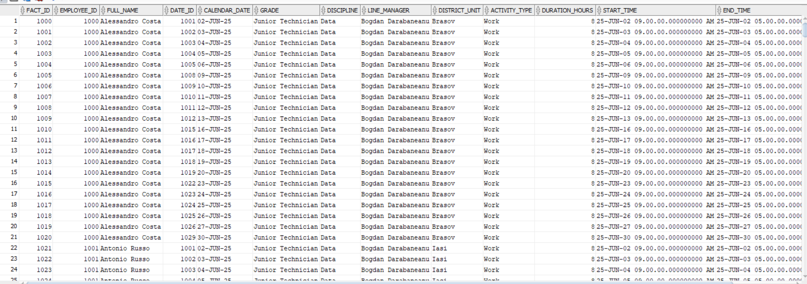
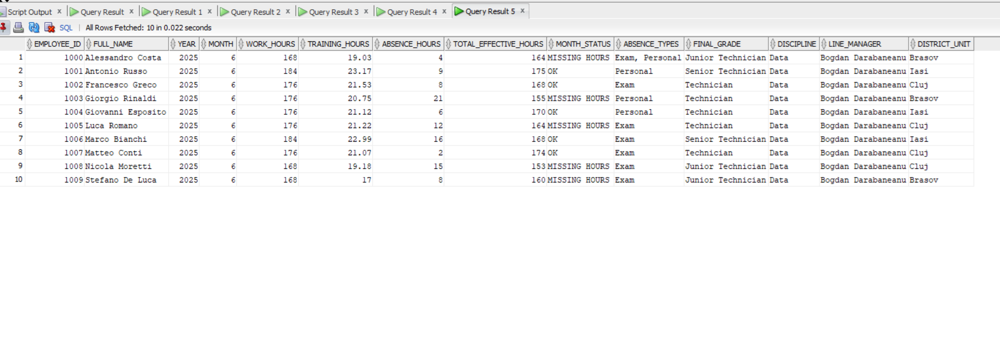

## ETL – Employee Activity Monitoring

Demonstration project showing how to manually model and populate a small star‑schema Data Warehouse that tracks employee daily activities: worked hours, training, absences (Exam, Personal) and historical attributes (grade, district, line manager).

The raw source consists of two CSV files manually imported into Oracle staging tables, then transformed via SQL / PL/SQL scripts into dimension and fact tables. Reports are exposed through aggregate views.

> IMPORTANT: Loading (importing the CSV files into the staging tables) is a MANUAL step done in Oracle (SQL Developer / SQL*Loader). The scripts in the repository do NOT auto‑ingest the files.

---

## 1. Project Structure

Key files:

| File | Description |
| ---- | ----------- |
| `Activity.csv` | Activities / absences (Exam, Personal, etc.) – source for `SOURCE_ACTIVITY_TEMP` |
| `Training.csv` | Training events – source for `SOURCE_TRAINING_TEMP` |
| `Baba_Alexandru_tema_tables.sql` | Users, sequences and table creation (staging + dimensions + fact) |
| `Baba_Alexandru_tema_inserts.sql` | Sample population: dimensions, fact data, employee history |
| `Baba_Alexandru_tema_queries.sql` | View creation and reporting queries |
| `Employee daily activity.png` | Daily activity capture |
| `Employee monthly report.png` | Monthly aggregate report capture |
| `README.md` | Project documentation |

---

## 2. Data Model (Star Schema)

Dimension tables:
- `TARGET_DIM_EMPLOYEE` – employee master
- `TARGET_DIM_PROJECT` – project catalog (billable / non‑billable)
- `TARGET_DIM_DATE` – calendar (surrogate date key + attributes)
- `TARGET_DIM_ABSENCE_TYPE` – absence types (Annual, Medical, Personal, Exam)
- `TARGET_DIM_EMPLOYEE_HISTORY` – slowly changing attributes (grade, district, line manager) – simplified SCD Type 2 (date ranges)

Fact table:
- `TARGET_FACT_EMPLOYEE_ACTIVITY` – daily activities (Work, Training, Exam, Personal, Annual Leave, Medical Leave) referencing dimensions via surrogate keys.

Staging tables:
- `SOURCE_ACTIVITY_TEMP`
- `SOURCE_TRAINING_TEMP`

Sequences: `SEQ_EMPLOYEE`, `SEQ_PROJECT`, `SEQ_DATE`, `SEQ_FACT_ACTIVITY`, `SEQ_ABSENCE_TYPE`, `SEQ_HISTORY`.

Key relationships:
- FACT.EMPLOYEE_ID → DIM_EMPLOYEE.EMPLOYEE_ID
- FACT.DATE_ID → DIM_DATE.DATE_ID
- FACT.PROJECT_ID → DIM_PROJECT.PROJECT_ID (NULL for non‑project events)
- HISTORY.EMPLOYEE_ID → DIM_EMPLOYEE.EMPLOYEE_ID

---

## 3. ETL Flow (Manual)

1. (Optional) Connect as SYS / DBA and run the user creation part from `Baba_Alexandru_tema_tables.sql`:
   - `CREATE USER SRC_USER IDENTIFIED BY src_password;`
   - `CREATE USER TGT_USER IDENTIFIED BY tgt_password;`
   - Grant the listed privileges.
2. Execute the DDL script (`Baba_Alexandru_tema_tables.sql`). If objects do not exist yet, DROP errors can be ignored.
3. In SQL Developer (or similar client): create a connection as the owning user (typically `TGT_USER`) unless consolidated.
4. Manually import CSVs into staging:
   - Open `SOURCE_ACTIVITY_TEMP` → Import Data → choose `Activity.csv` → map columns → Finish.
   - Open `SOURCE_TRAINING_TEMP` → Import Data → choose `Training.csv`.
   (Alternative approaches: SQL*Loader / external tables – not covered here.)
5. Run `Baba_Alexandru_tema_inserts.sql` to populate dimensions, generate fact work rows via PL/SQL, and load employee history.
6. Run `Baba_Alexandru_tema_queries.sql` to create reporting views.
7. Query the views / tables for validation and export.

### Note on hour calculation
Duration is computed as the (END_TIME − START_TIME) interval converted to hours (rounded to 2 decimals). Weekends are excluded from generated Work rows.

---

## 4. Views & Reporting

1. `V_EMPLOYEE_PROFILE` – current profile snapshot (history row where `END_DATE` IS NULL).
2. `V_EMPLOYEE_AT_DATE` – aligns fact activities with the valid historical attributes on that date.
3. `V_EMPLOYEE_MONTHLY_REPORT` – monthly aggregation: Work hours, Training hours, Absence hours, Effective hours (Work − Absences), month status (OK / MISSING HOURS), distinct absence types, final grade / attributes.

### Quick check example
```
SELECT * FROM V_EMPLOYEE_MONTHLY_REPORT ORDER BY FULL_NAME, YEAR, MONTH;
```

---

## 5. Results (Screenshots)

### Daily Activity


### Monthly Report


---

## 6. Data Quality & Cleanup

The script contains a duplicate cleanup step for absences (Annual / Medical / Exam / Personal), retaining only the first occurrence (`MIN(ROWID)`) for each (EMPLOYEE_ID, DATE_ID, ACTIVITY_TYPE, START_TIME, END_TIME).

Additional recommendations:
- Add NOT NULL constraints where business rules require.
- Index join columns (EMPLOYEE_ID, DATE_ID, PROJECT_ID) and `(EMPLOYEE_ID, START_DATE)` in the history table.
- Validate `END_TIME >= START_TIME` in staging (trigger / check constraint).

---

## 7. Design Considerations

- Simplified star schema; `TARGET_DIM_EMPLOYEE_HISTORY` behaves like a light SCD Type 2 using date ranges.
- Absence types separated into `TARGET_DIM_ABSENCE_TYPE` for flexibility; could be collapsed into the fact for a very small scope.
- Training does not reduce effective hours (only Work − Absences). Adjust if business logic changes.
- Calendar generation currently limited to June 2025 – extend for broader reporting.

---

## 8. Potential Improvements

1. Automate CSV ingestion (External Tables / SQL*Loader / PL/SQL package).
2. Scheduling via DBMS_SCHEDULER for daily incremental loads.
3. Incremental logic (detect new dates only).
4. Audit & logging tables (ETL_RUN, ETL_ERROR).
5. PL/SQL packaging of logic (`PKG_ETL_LOAD`).
6. SQL test harness (pre/post CTE comparisons) for integrity.
7. Extend activity types (Overtime, OnCall) + KPIs.

---


